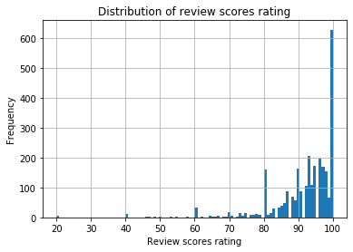
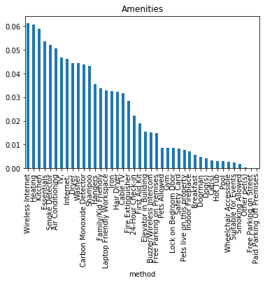
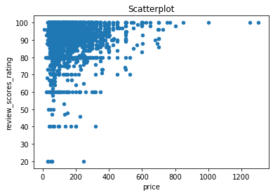
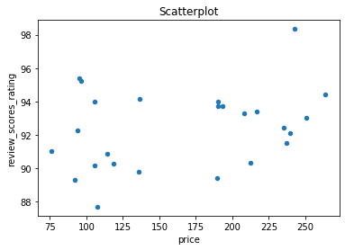
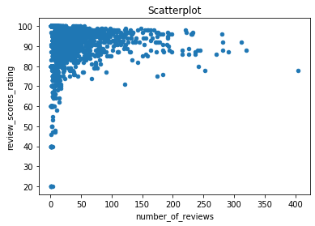
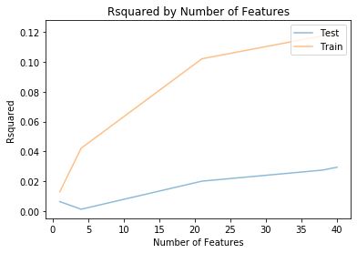
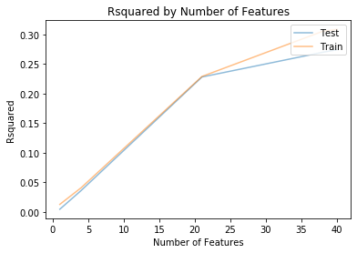

# How to make MOST of your let accommodations - Are there easy ways to INCREASE your review scores rating?

## Introduction
AirBNB is obviously a great way to make some extra money if you own some unused space in a popular city. However, how can you optimize this since you compete with many other accommodations? What would people select for a stay if there are different options fulfilling their requirements in terms of location, amenities, size, and similar features? Yes, the price is probably an important thing. But this definitely depends also on the people's overall budget they want to spend. In the end, the review scores rating by other visitors might play an important role.

Is there a way to predict the actual scores rating from the features of an accommodation? If so, could you increase your scores rating by adding a few additional amenities to your accommodation? Let´s look into some data to get an answer: In my analysis, I used Boston AirBNB data downloaded from Kaggle. The data is available [here](https://www.kaggle.com/airbnb/boston/data) (select the file "listings.csv"). It consists of data from 3585 accommodations in Boston.

## Business questions
Although there is one main question described above, there are a number of additional questions which help to answer how to increase your score rating.

* Question 1: Is there a correlation between price and review scores rating?
* Question 2: Are there differences in review scores rating and price between different neighbourhoods? This is something you cannot influence if you have a given accommodation for let.
* Question 3: Is there a correlation between number of reviews and review scores rating?
* Question 4: Is there a relation between amenities and review scores rating? Which amenities seems to be the most important ones?
* Final questions 5: Is there a way to predict the review scores rating based on amenities and price?

Note: I focused on the price per night and the overall review scores rating. There are some specific columns in the dataset like weekly price or the rating for cleanliness, but these are not considered here. 

## Data understanding and preparation
Before starting the analysis, it was necessary to prepare the data. For example, the price column contained $-signs and commas as decimal separators. The amenities of the different accommodations have been encoded as combined strings in one column of the dataset. Furthermore, there are several categorial variables e.g. for neighbourhood and type of the property. These columns have been replaced by binary dummy columns in order to allow the creation of linear regression models. Finally, rows with missing values in the review scores rating column have been removed which reduces the number of rows to 2772.

The following histograms show the distributions of the price and the review scores rating. It is noticeable that the distribution of the rating is strongly left-skewed and that nearly a fifth of the accommodation has the highest possible rating.

")

Furthermore, the distribution of amenities over all accommodations has been calculated. It is shown in the following plot.

## Question 1: Is there a correlation between price and review scores rating?
The price might be an important factor for the review scores rating. Maybe a cheap price indicates a higher probability that the stay is in the end not as pleasant as expected? Or maybe people renting an accommodation with a high price have higher demands and would not tolerate any shortcomings which would result in a lower rating? However, the following scatter plot shows the relation between the two measures:

Although, it uncovers some trend, the Pearsons correlation coefficient is just at 0.106, indicating only a slight correlation. Interestingly, the variance in review scores rating is higher in lower price regions. In high price regions, there seem to be no real bad ratings. Nevertheless, the number of data points is relatively low here. Thus, as an answer, yes, there is a slight correlation.

## Question 2: Are there differences in review scores rating and price between different neighbourhoods?
It has been checked whether there are differences in review scores ratings and price between different neighbourhoods. Obviously, there are price differences between different neighbourhoods in every city. However, what if a scatterplot is used to compare the review scores rating and the price for each accommodation based on the mean values for each neighbourhood? This looks as follows:

It is not looking nice but the Pearsons correlation coefficient is already 0.318. Thus, there is a dependency to the neighbourhood. Higher ratings indicate here to stay in a more expensive neighbourhood. However, this cannot be influences by the renter. Thus, it is removed from further analysis. The same holds for property type and room type. Thus, these columns are no longer considered.

## Question 3: Is there a correlation between number of reviews and review scores rating?
Before making predictions, it is checked whether the number of reviews show some correlation with the review scores rating, especially due to the very strongly skewed distribution of review scores rating.

The scatterplot shows an interesting pattern. However, the correlation coefficient not indicates a relation between the two measures (Pearson correlation coefficient: 0.023). Obviously, the individual review score rating means of accommendations with a lower number of reviews have a higher variance in comparison to accommendations with many reviews. Thus, the number of reviews is not taken into account for the further analysis.

## Question 4: Is there a relation between amenities and review scores rating?
To answer this question, a linear regression model has been trained based on the presence or absence of 42 different amenities in the dataset to predict the review scores rating. The result is a bit disappointing. The R^2 fit value is just at 0.0277.

## Final questions 5: Is there a way to predict the review scores rating based on amenities and price?
Since question 1 and 2 showed slight correlation of price with review scores rating, the price has been added to build the model. However, the R^2 has not been changed much with a value of 0.0285. To fully uncover the possibilities, the process has been performed for a lot of subsets of the selected input data containing a different number of features. The following plot shows the R^2 values based on the training set and an independent test set.

The plot shows a very weak R^2 values already on the training data. For test data the model seems to be completely useless. Thus, it seems to be not possible to predict the review scores rating based on amenities and price.

In order to show that the approach itself works fine, price and review scores rating have been exchanged by each other in a final experiment. This means that review scores rating and amenities have been used to predict the price. The same type of linear regression has been performed as before. See the results here:

Now it looks completely different. The R^2 values are much better and the model also works comparably well on the test set.

## Conclusion
The results show that there seems to be no way to predict the reviews scores rating from the information of an accommodation in the dataset. This might be disappointing to owners of unused space in the big attractive cities on this plant. However, one possible explanation might also be a bit soothing:

The reason to give a high or a low rating might base in the end on the overall experience of a stay. It is not about price or amenities, since here people can have anyway completely different demands. You can be very happy in a sparse room. In the end, it might be e.g. about support of the renters in case of issues or other soft factors. This is something for which an additional analysis would be interesting. However, we cannot not learn this from the given dataset.

Nevertheless, I also like to also note that the distribution of review scores rating itself was bit challenging due to its strong skewness. It would be worth to find out why this is the case. Since a high fraction of accommodations have a top rating, it might be that there is a trend to overrate the stay which is a bit surprising since one can also assume that people who are disappointed from their stay give a bad review score. A theory would be that low rated accommodations are removed by their owners and registered again. This needs to be check with the terms of reference of AirBNB.

If you want to see some more details, see my Jupyter-Notebook I have created for this analysis in my GitHub repository [here](https://github.com/MiRoDS/DataScience_Project1).
