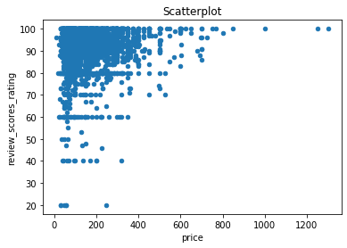
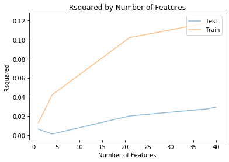

# Capstone Project - Analysis of the Corona pandemic

## Introduction
In this project, data from the ongoing "Corona" pandemic is analyzed. The SARS-CoV-2 virus has spread around the world in a relatively short time after its first apperance in Wuhan (China) and the caused disease COVID-19 (=coronavirus disease 2019) stresses the healthcare systems in many countries. Here, the growth over the time after start of the outbreak in the different countries is visualized and measures are introduced to compare the intensities of the outbreaks. Furthermore, it is checked whether there are specific driving forces for the exponential growths rates and effective measures against.

Therefor, two datasets are analyzed that are later on combined to one:

One dataset has been taken from the CSSE at Johns Hopkins University: It shows timeseries regarding cumulative Corona cases of all affected countries. The data has been taken from the following GitHub repository. Please note, that the data is updated every day. Thus, there might be effects on the conclusion in a few weeks. For this analysis, data taken on April 24th has been used. The data is available [here](https://github.com/CSSEGISandData/COVID-19/edit/master/csse_covid_19_data/csse_covid_19_time_series/time_series_covid19_confirmed_global.csv) (also stored in [DataScience_Project4 GitHub](https://github.com/MiRoDS/DataScience_Project4)).

Another dataset has been downloaded from Kaggle. It gives an overview on different Corona-related information for the affected countries and is available [here](https://www.kaggle.com/koryto/countryinfo#covid19countryinfo.csv) (also stored in [DataScience_Project4 GitHub](https://github.com/MiRoDS/DataScience_Project4)).

## Questions
There are a number of questions for the analysis should give answers or at least some hints.

* Question 1: How can the data be prepared so that outbreaks in different countries can be visualized?
* Question 2: What could be a measure to compare the intensities of the outbreaks?
* Question 3: What are the effects of the initial situation in the different countries on the outbreak intensity?
* Question 4: Is it possible to come up with a measured value to compare the effectiveness of measures against the disease?
* Question 5: What are the effects of the different measures to contain the disease?

## Data understanding
At first, several data preparation steps were necessary to prepare the both datasets for timeseries and country information before combining them to one set.

The timesseries set contains 264 rows for different countries/regions. However, in some cases it is differentiated between different provinces/states. Beside the geographical position (longitute and latitude) there are columns for every day starting from 1/22/2020 showing the number of confirmed cases.

In comparison, the country information set makes differentiations between different regions within countries. It is not fitting to the timeseries list but in the overwhelming number of cases, there is just one row per nation. It contains 249 rows and 60 columns with different information on the situations in the regions/countries. Some of them are also related to the number of cases in specific weeks subdivided in new cases, recovered cases, and cases of death. They are not considered here, since more detailled information on the progress of the epedemics are taken from the timeseries. However, general information on the amount of citizens per square meter, median age of population, percentage of urban population, average temperature, and humidity are taken into account to check whether these characteristics have an effect. Additionally, the dataset contains information on which dates measures have been taken to contain the diseases. These are quarantine, school closure policy, closing of public places like bars and restaurants, non-gathering restrictions, and non-essential house leavings. However, for the most regions/countries this information does not exists (or the measures were not taken).

## Data preparation
To make it possible to prepare the datasets, the different provinces/states of the same country/region in the timeseries have been combined by summing up the cases per day. This was necessary in 7 cases, e.g. for China information from 33 rows has been gathered so that in the end, one row represents one nation (185 overall). The following plot visualized the series of the 10 countries with the highest number of infections.

## Question 1: Is there correlation between price and review scores rating?
The price might be an important factor for the review scores rating. Maybe a cheap price indicates a higher probability that the stay is in the end not as pleasant as expected? Or maybe people renting an accommodation with a high price have higher demands and would not tolerate any shortcomings which would result in a lower rating? However, the following scatter plot shows the relation between the two measures:

Although, it uncovers some trend, the Pearsons correlation coefficient is just at 0.1057, indicating only a slight correlation. Interestingly, the variance in review scores rating is higher in lower price regions. In high price regions, there seem to be no real bad ratings. Nevertheless, the number of data points is relatively low here. Thus, as an answer, yes, there is a slight correlation.

## Question 2: Are there differences in review scores rating and price between different neighbourhoods?
It has been checked whether there are differences in review scores ratings and price between different neighbourhoods. Obviously, there are price differences between different neighbourhoods in every city. However, what if a scatterplot is used to compare the review scores rating and the price for each accommodation based on the mean values for each neighbourhood? This looks as follows:

It is not looking nice but the Pearsons correlation coefficient is already 0.3177. Thus, there is a dependency to the neighbourhood. Higher ratings indicate here to stay in a more expensive neighbourhood. However, this cannot be influences by the renter. Thus, it is removed from further analysis. The same holds for property type and room type. Thus, these columns are no longer considered.

## Question 3: Is there correlation between number of reviews and review scores rating?
Before making predictions, it is checked whether the number of reviews show some correlation with the review scores rating, especially due to the very strongly skewed distribution of review scores rating.

The scatterplot shows an interesting pattern. However, the correlation coefficient of 0.0228 does not indicate a relation between the two measures. Obviously, the individual review score rating means of accommendations with a lower number of reviews have a higher variance in comparison to accommendations with many reviews. Thus, the number of reviews is not taken into account for the further analysis.

## Question 4: Is there a relation between amenities and review scores rating?
To answer this question, a linear regression model has been trained based on the presence or absence of 42 different amenities in the dataset to predict the review scores rating. The result is a bit disappointing. The R^2 fit value is just at 0.0277.

## Final questions 5: Is there a way to predict the review scores rating based on amenities and price?
Since question 1 and 2 showed slight correlation of price with review scores rating, the price has been added to build the model. However, the R^2 has not been changed much with a value of 0.0285. To fully uncover the possibilities, the process has been performed for a lot of subsets of the selected input data containing a different number of features. The following plot shows the R^2 values based on the training set and an independent test set.

The plot shows a very weak R^2 values already on the training data. For test data the model seems to be completely useless. Thus, it seems to be not possible to predict the review scores rating based on amenities and price.

In order to show that the approach itself works fine, price and review scores rating have been exchanged by each other in a final experiment. This means that review scores rating and amenities have been used to predict the price. The same type of linear regression has been performed as before. See the results here:

Now it looks completely different. The R^2 values are much better and the model also works comparably well on the test set.

## Conclusion
The results show that there seems to be no way to predict the reviews scores rating from the information of an accommodation in the dataset. This might be disappointing to owners of unused space in the big attractive cities on this plant. However, one possible explanation might also be a bit soothing:

The reason to give a high or a low rating might base in the end on the overall experience of a stay. It is not about price or amenities, since here people can have anyway completely different demands. You can be very happy in a sparse room. In the end, it might be e.g. about support of the renters in case of issues or other soft factors. This is something for which an additional analysis would be interesting. However, we cannot not learn this from the given dataset.

Nevertheless, I also like to note that the distribution of review scores rating itself was bit challenging due to its strong skewness. It would be worth to find out why this is the case. Since a high fraction of accommodations have a top rating, it might be that there is a trend to overrate the stay which is a bit surprising since one can also assume that people who are disappointed from their stay give a bad review score. An idea would be that low rated accommodations are removed by their owners and registered again. It needs to be checked whether this would be compliant with the terms of reference of AirBNB.

If you want to see some more details, see my Jupyter-Notebook I have created for this analysis in my GitHub repository [here](https://github.com/MiRoDS/DataScience_Project4).
