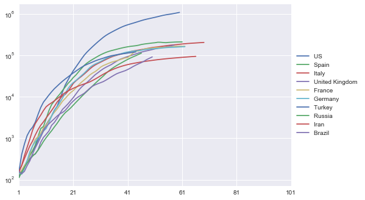

# Capstone Project - Analysis of the Corona pandemic

## Introduction
In this project, data from the ongoing "Corona" pandemic is analyzed. The SARS-CoV-2 virus has spread around the world in a relatively short time after its first apperance in Wuhan (China) and the caused disease COVID-19 (=coronavirus disease 2019) stresses the healthcare systems in many countries. Here, the growth over the time after start of the outbreak in the different countries is visualized and measures are introduced to compare the intensities of the outbreaks. Furthermore, it is checked whether there are specific driving forces for the exponential growths rates and effective measures against.

Therefor, two datasets are analyzed that are later on combined to one:

One dataset has been taken from the CSSE at Johns Hopkins University: It shows timeseries regarding cumulative Corona cases of all affected countries. The data has been taken from the following GitHub repository. Please note, that the data is updated every day. Thus, there might be effects on the conclusion in a few weeks. For this analysis, data taken on April 24th has been used. The data is available [here](https://github.com/CSSEGISandData/COVID-19/edit/master/csse_covid_19_data/csse_covid_19_time_series/time_series_covid19_confirmed_global.csv) (also stored in [DataScience_Project4 GitHub](https://github.com/MiRoDS/DataScience_Project4)).

Another dataset has been downloaded from Kaggle. It gives an overview on different Corona-related information for the affected countries and is available [here](https://www.kaggle.com/koryto/countryinfo#covid19countryinfo.csv) (also stored in [DataScience_Project4 GitHub](https://github.com/MiRoDS/DataScience_Project4)).

## Questions
There are a number of questions for which the analysis should give answers or at least some hints.

* Question 1: How can the data be prepared so that outbreaks in different countries can be visualized?
* Question 2: What could be a measure to compare the intensities of the outbreaks?
* Question 3: What are the effects of the initial situation in the different countries on the outbreak intensity?
* Question 4: Is it possible to come up with a measured value to compare the effectiveness of measures against the disease?
* Question 5: What are the effects of the different measures to contain the disease?

## Data overview
At first, several data preparation steps were necessary to prepare the both datasets for timeseries and country information before combining them to one set.

The timesseries set contains 264 rows for different countries/regions. However, in some cases it is differentiated between different provinces/states. Beside the geographical position (longitute and latitude) there are columns for every day from 1/22/2020 which shows the number of confirmed cases.

In comparison, the country information set makes differentiations between different regions within countries. It is not fitting to the timeseries list but in the overwhelming number of cases, there is just one row per nation. It contains 249 rows and 60 columns with different information on the situations in the regions/countries. Some of them are also related to the number of cases in specific weeks subdivided in new cases, recovered cases, and cases of death. They are not considered here, since more detailled information on the progress of the epedemics are taken from the timeseries. However, general information e.g. on the

* amount of citizens per square meter,
* median age of population,
* percentage of urban population,
* average temperature, 
* humidity

and some others might be useful for the analysis. Additionally, the dataset contains information on which dates measures have been taken to contain the diseases. These are 
* quarantine,
* school closure policy,
* closing of public places like bars and restaurants,
* non-gathering restrictions, and
* non-essential house leavings.

However, for the most regions/countries this information does not exists (or the measures were not taken which is unclear from the data).

## Data understanding and preparation
### Timeseries dataset
To make it possible to prepare the datasets, the different provinces/states of the same country/region in the timeseries have been combined by summing up the cases per day. This was necessary in 7 cases, e.g. for China information from 33 rows has been gathered so that in the end, one row represents one nation (185 overall). The column Country/Region has been renamed to 'country'. After the step, the provinces/states column is no longer used. The following plot visualized the series of the 10 countries with the highest number of infections.

Since the start date of the outbreaks in the different countries were very different, the data has been normalize to a "day 1" which is the day when a specific number of cases has been detected in each individual country. The idea is that for a lower number of cases, the situation is under control and that the uncontrolled exponential growth has not started yet. The plot below visualizes the overlaying curves after normalizing to a "day 1" with at least 100 detected cases per country (**This is essentially an answer to question 1.**).

The plot above show that the growth in the shown countries is clearly exponentially at the beginning and tends then to a more linear phase with a constant and in the end sometimes decreasing number of new cases. An exception is China. In China there is a second strong increase. After that no more new cases have been reported. To illustrate the exponential growth in a better way, a logarithmic scale has been used for the y-axis in the folloing plot. Furthermore, the timeseries have been applied to a Savitzky-Golay filter before which is a robust noise filter using polynomial regression which causes no bias in exponential growth phases.

### Country information dataset
As for the timeseries dataset, it was necessary to remove some rows. Although, for some countries differentiations are made for several regions, e.g. all 50 states for the US, there is always one row for the country in general. Thus, only this general row has remained. However, due to this step some information is not used but it is necessary that a corresponding timeseries exist for each entry in the other dataset. Furthermore, it was necessary to convert some columns into number columns since they have been interpreted first as strings due to the used comma-delimiters in the original data.

After this step it is possible to merge the two datasets by the column 'Country'.

However, another preparation step has been made. The dates on which measures have been taken to contain the diseases have been replaced by the number of days between the outbreak within the country and the start of the measure. Note, that this number can be negative in case that the measures has been taken before the detected outbreak. In case that no measure was taken or the information is not know (nan in both cases) a high number of penality costs has been added so that the columns can be used for later caluculations.

## Modelling and Evaluation
### A simple model for the spread of a viruis epedemic
Before the next steps are made, some thought on the spread of a virus. Let assume that there is at first an unbraked spreading. The spreading rate depends on a general conditions, e.g. how often people converge since the main transmission route for SARS-CoV-2 is droplet contact. The unbraked spreading fits good to the visualizations above since the curves rise according to an exponential increase. Note: This is the assumption and certainly a bit simplified. At some point, the growth rate is flatten. This is due to governmental measures and attitude changes of the people, e.g. keeping distance of others, but it would also flatten without measures since at some point a saturation effect would occur as more people become infected.

## Conclusion
If you want to see some more details, see my Jupyter-Notebook I have created for this analysis in my GitHub repository [here](https://github.com/MiRoDS/DataScience_Project4).
