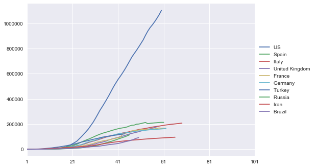
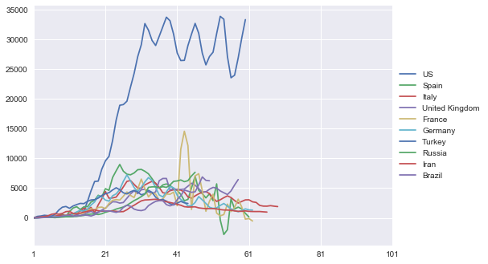
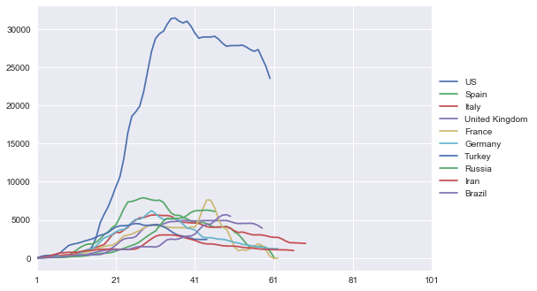

# Capstone Project - Analysis of the Corona pandemic

## Introduction
In this project, data from the ongoing “Corona” pandemic is analyzed. The SARS-CoV-2 virus has spread around the world in a relatively short time after its first appearance in Wuhan (China) and the caused disease COVID-19 (=coronavirus disease 2019) stresses the healthcare systems in many countries. Here, the growth over the time after start of the outbreak in the different countries is visualized and ratios are introduced to compare the intensities of the outbreaks. Furthermore, it is checked whether there are specific driving forces for the exponential growths and effective measures against that allow to make predictions.

For this analysis two datasets have been used that are later on combined to one:

One dataset has been taken from the CSSE at Johns Hopkins University: It shows timeseries regarding cumulative Corona cases of all affected countries. The data has been taken from the following GitHub repository. Please note, that the data is updated every day. Thus, there might be effects on the conclusion in a few weeks. For this analysis, data taken on May 1st, 2020 has been used. The data is available [here](https://github.com/CSSEGISandData/COVID-19/edit/master/csse_covid_19_data/csse_covid_19_time_series/time_series_covid19_confirmed_global.csv) (also stored in [DataScience_Project4 GitHub](https://github.com/MiRoDS/DataScience_Project4)).

Another dataset has been downloaded from Kaggle. It gives an overview on different Corona-related information for the affected countries and is available [here](https://www.kaggle.com/koryto/countryinfo#covid19countryinfo.csv) (also stored in [DataScience_Project4 GitHub](https://github.com/MiRoDS/DataScience_Project4)).

## Questions
There are a number of questions for which the analysis should give answers or at least some hints.

* Question 1: How can the data be prepared so that outbreaks in different countries can be compared and visualized?
* Question 2: What could be ratios to compare the outbreaks in the different countries?
* Question 3: What are the effects of the initial situations in the different countries on the outbreak intensity?
* Question 4: Is it possible to make predictions on the development of the disease?

## Data overview
At first, several data preparation steps were necessary to prepare the both datasets for timeseries and country information before combining them to one set.

The timeseries set contains 266 rows for different countries/regions. However, in some cases it is differentiated between different provinces/states. Beside the geographical position (longitude and latitude) there are columns for every day from 1/22/2020 which shows the number of confirmed cases.

In comparison, the country information set makes differentiations between different regions within countries. It is not fitting to the timeseries list but in the overwhelming number of cases there is just one row per nation. It contains 249 rows and 60 columns with different information on the situations in the regions/countries. Some of them are also related to the number of cases in specific weeks subdivided in new cases, recovered cases, and cases of death. They are not considered here, since more detailed information on the progress of the epidemics are taken from the timeseries. However, general information e.g. median age of population, percentage of urban population, average temperature, and some others might be useful for the analysis. Additionally, the dataset contains information on which dates measures have been taken to contain the diseases. These are 
* quarantine,
* school closure policy,
* closing of public places like bars and restaurants,
* non-gathering restrictions, and
* non-essential house leavings.

However, for the most regions/countries this information does not exists (or the measures were not taken which is unclear from the data).

## Data understanding and preparation
### Timeseries dataset
To make it possible to compare the datasets, the different provinces/states of the same country/region in the timeseries have been combined by summing up the cases per day. This was necessary in 7 cases, e.g. for China information from 33 rows has been gathered so that in the end, one row represents one nation (185 overall). The column Country/Region has been renamed to 'Country'. After the step, the provinces/states column is no longer used. The following plot visualizes exemplarily the series of the 10 countries with the highest number of infections.

It shows exponential growth curves. They change to more linear curves after some time which is clearly visible e.g. for the US. Some curves e.g. for France show a saltus (possibly after later corrections of case numbers). The following plot zooms into the time axis and shows only the development till end of March to give a better view on the exponential growth. Here it is clearly visible that China (not shown above since it is not amongst the top 10 countries) shows an uncommon development of the disease. There is a second strong increase of case numbers followed by a phase where no new cases occur.

Since the start dates of the outbreaks in the different countries were very different, the data has been normalized to a "day 1" which is the day when a specific number of cases has been detected in each individual country. The idea is that for a lower number of cases the situation is under control and that the uncontrolled exponential growth has not started yet. The plot below visualizes the overlaying curves after normalizing to a "day 1" with at least 100 detected cases per country.

To illustrate the exponential growth in a better way, a logarithmic scale has been used for the y-axis in the following plot. Furthermore, the timeseries have been applied to a Savitzky-Golay filter before which is a robust noise filter using polynomial regression which causes no bias in exponential growth phases.

### Country information dataset
Like for the timeseries dataset, it was necessary to remove some rows from the country information dataset. Although, for some countries differentiations are made for several regions, e.g. all 50 states for the US, there is additionally always one row for the country in general. Thus, only this general row has remained. However, due to this step some information is not used but it is necessary that a corresponding timeseries exist for each entry in the other dataset. Furthermore, it was necessary to convert the content of some columns into numbers since they have been interpreted first as strings due to the used comma-delimiters in the original data. After this step it is possible to merge the two datasets by the column 'Country'.

However, another preparation step has been made. The dates on which measures have been taken to contain the diseases have been replaced by the number of days between the outbreak within the country and the start of the measure. Note, that this number can be negative in case that the measures has been taken preventively before the detected outbreak. In case that no measure was taken or the information is not known (NaN in both cases), penalty costs (here a value of 50) have been added so that the columns can be used for later calculations.

## Modelling and Evaluation
### A simple model for the spread of a virus epidemic
Before going to the next steps, the spread of a virus disease is discussed. At first, an unbraked spreading can be observed. The spreading rate depends on general conditions, in this case e.g. how often people converge since the main transmission route for SARS-CoV-2 is droplet contact. The unbraked spreading fits good to the visualizations above since most of the curves rise according to an exponential growth. Note: This is the assumption and certainly a bit simplified. At some point, the growth rate is flattened. This is due to governmental measures and attitude changes of the people, e.g. keeping distance of others, but it would also flatten without measures since at some point a saturation effect would occur as more people become infected.

Thus, to compare the spreading rates between the different countries, the point in time must be found at which the exponential growth starts to slow down and other effects superimpose. However, how can this point be found?

### Calculation of the derivatives
The first step is the calculation of the number of new cases per day which is, mathematically spoken, the derivative of a timeseries. A function for this has been implemented. The following plot shows a visualization (again exemplarily for the 10 countries with the most known infections).

Most of the derivatives seem to show cyclic fluctuations on a weekly base. A reason might be that new cases on weekend are reported with delay to the health authorities. A first analysis of this data showed issues in the subsequent steps. Thus, a median filter with a width of 7 (for 7 days per week) has been applied to the derivatives as a refinement. Additionally, the Savitzky-Golay filter has been applied subsequently, to filter for remaining noise in the data. The following plot shows the result.

However, what is now the point in time at which the exponential growth slows down? It must be the point at which the increase of new cases per day is highest: Mathematically, this is the maximum of the second derivative also known as the inflection point. It is visualized in the following plot. Please note, that the shown curves have also been applied to a median filter and a Savitzky-Golay filter.

### Spreading Factor and Days till Max
Based on considerations about the model, two ratios have been calculated from the values of first and second derivatives. The first one is the Spreading Factor which explains the mean growth per day from the start of the outbreak till the inflection point when the spreading rate starts to decreases. Let d be the number of days till the inflection point:

Another ratio is the number of days between the inflection point (maximum of second derivative) and the maximum of new cases per day (maximum of first derivative):

After the inflection point, the number of new cases per day starts to decrease. The idea is that this could be a ratio for the effect of measures, since the smaller the number, the more efficient might be the measures.

The following table shows the ratios for some selected countries that were early in the news regarding serious outbreaks (see my Jupyter notebook for all countries [here](https://github.com/MiRoDS/DataScience_Project4)):

|Country    |Exponential phase length|Spreading Rate|Days till Max|
|-----------|------------------------|--------------|-------------|
|South Korea|5                       |1.605         |4            |
|China      |7                       |1.425         |5            |
|US         |25                      |1.318         |10           |
|Spain      |21                      |1.305         |6            |
|Italy      |20                      |1.277         |10           |
|Germany    |26                      |1.254         |3            |
|France     |23                      |1.248         |20           |
|Iran       |29                      |1.199         |3            |

The exponential phase length (in days) refers to the length between a detected outbreak (above the threshold) and the day of the inflection point. It is important to say that the ratios give no information on the number of cases per day or in general. These are values to compare characteristics of the first exponential growth phase, e.g. it is expected that a growing of case numbers in different phases as visible for China cannot be covered by the numbers.

In the next step, it has been checked which of the features in the dataset are correlated. In this analysis, the previously calculated ratios have been incorporated, as well as, the maximal number of new cases per day which is exactly the maximum of the first derivative. To visualize the correlation, the following heat map has been used.

### Correlation in the data

The heat map shows some interesting results although there no clear correlations with high scores. Nevertheless, it seems that the Spreading Factor is - amongst others - correlated with the median age, the number of hospital beds, the health expanses, and interestingly negatively correlated with the fertility and the average temperature. There are some other correlations which shall not be detailed here. However, it is notable that the maximal number of new cases per day is correlated with the GDP 2019 *(score of 0.838)* and the health expanses *(score of 0.462)*. For more details on the specific values see my Jupyter notebook [here](https://github.com/MiRoDS/DataScience_Project4).

### Prediction of the disease development
Two of the questions that have been asked at the beginning are related to the expected intensity and development of the diseases. Thus, features that show correlation have been used to train machine learning models in different approaches. In doing so, a Random Forest Regressor has been applied with 3-fold cross-validation (number of estimators: 10000, maximum depth: 16). In first experiments (not shown here) massive overfitting has been observed in all cases when using the whole dataset (resulting in mean scores around 0 on the test data). Thus, only those features have been selected which (1) seem to be useful according to the specific questions and which (2) show some correlation according to the matrix above.

Regarding the countries, there was also a selection necessary. Only those countries have been added, for which the exponential growth phase had a minimal length (in days). Here, the value 7 (which means one week) has been used. The rationale behind is that the model only works if there is a clear exponential growth phase. However, according to noisy data or an uncommon disease progress it is possible to find the inflection point very early e.g. at day 3. In this case, it cannot be expected that the model works well. After removing these rows as well as rows without detected growth (e.g. due to the fact that the overall case number stays below 100) 81 countries remained. 

#### Predict the Spreading Factor from country specific characteristics
Since the Spreading Factor is a ratio for the outbreak intensity, it has been checked whether it is possible to predict it just from the information about the countries. No data about the development of the disease itself has been incorporated. To this end, only those features have been selected that show a correlation above 0.2 or below -0.2 (negatively correlated). These are 'medianage', 'urbanpop', 'hospibed', 'gdp2019', 'healthexp', 'fertility', 'avgtemp', and 'Lat'. An exception is the "smoker" column. Although it shows correlation greater than 0.2, it has not been used due to too many NaNs. The resulting scores of the analysis are *0.917 (Training)* and *0.366 (Test)*.

#### Predict the Days till Max as a effect from measures against the disease
After that, it has been checked whether it is possible to predict the effect of measures against the disease estimated by the values for 'Days till Max'. It is assumed that it is not possible with the given data since the overwhelming number of rows contained no information on dates at which measures have been started or whether there were measures at all. Additionally, the column 'urbanpop' and the Spreading Factor itself have been incorporated. The scores of the analysis are *0.865 (Training)* and *0.043 (Test)*. Thus, there is no way to make predictions which has been expected.

#### Predict maximum number of new cases by using early case numbers
Finally, case numbers from the first two and four weeks are used additionally to predict the maximum number of cases per day. This could be relevant since it gives an estimation on the required capacity of intensive care units. Thus, countries can prepare for the peak from the early days of the outbreaks. Additionally, features correlating with the maximum number of cases per day with a score greater than 0.2 have been used that are 'pop', 'gdp2019', and 'healthexp'. To avoid overfitting due to too many additional features, only the case numbers of every second (for the first two weeks) or every fourth day (for the first four weeks), respectively, have been used. The training for data from the first two weeks shows scores of *0.915 (Training)* and *-0.512 (Test)*. However, the training for data from the first four weeks returned scores of *0.927 (Training)* and *0.385 (Test)* which is not a good value but it leads into the right direction. Please note, that in the second case 5 additional countries have been removed from the dataset since the disease has not yet run for four weeks.

## Conclusion
It has been shown in a number of steps how to visualize the development of the diseases in different countries in a way that these countries can be compared. Furthermore, it is easy to see from the visualizations whether the spreading is still in its exponential phase or whether effects are visible showing that the situation starts to go into a direction to bring it back under control **(Question 1)**.

A model has been discussed and two ratios have been introduced to compare the disease **(Question 2)**: The Spreading Factor gives an estimation on the mean growth till the day at which the exponential growth starts to flatten (maximum of second derivative). The Days till Max is the number of days from the maximum of second derivative till the maximum of new cases per day. It was not really possible to find out whether the second ratio is useful since the dataset contains not too many information on governmental measures to contain the disease.

An analysis of correlation between features of the dataset and the derived ratios showed some interesting information, e.g. the Spreading Factor is slightly positively correlated with: median age, the percentage of urban population, the number of hospital beds, percentage of smokers, the GDP 2019, the health expenses, and the Latitude. However, the latter one might be a result of the temperature, since this one is slightly negatively correlated, as well as the fertility rate. However, this gives some hints regarding the outbreak intensity **(Question 3)** and some ideas on reasons: A higher median age might result in more cases with hospitalization which are more likely uncovered. A higher GDP, more health expenses or hospital beds indicate more rich countries that have more test capacities to uncover cases. In these countries the fertility rate is typically below the average. However, the negative correlation with temperature might indicate that the infection risk is lower in summer month. This will be answered in a few months.

The results of machine learning show that it is not an easy problem to predict the development of the COVID-19 disease **(Question 4)**. Although, the fits on the training sets were not too bad, it was not easy to perform well on independent test data. However, there was some tendency to get an idea on the Spreading Factor and an additionally, if the case number of the first 4 weeks have been observed, on the maximum peak of new cases per day, e.g. to prepare the health system for it.

Overall, the used model makes a lot of simplifications. Moreover, the used data is not really reflecting the reality. For example, it is unclear how many people are really infected since the course of the disease is in many cases a light one so that no hospitalization is required. Furthermore, there are reports on many cases where the disease is completely without symptoms so that there is a high dark figure of uncovered cases (there are estimates on the factor in the range from 3 to 10). Since it is unclear whether a person is infected by a known case or an unknown case, it is even more challenging to model the process. Another factor is that the test capacity has been increased over the time. Thus, a fraction of the exponential growth which has been observed might be an effect of more tests per day.

Additionally, there are other effects which would naturally reduce the growth long before saturation is visible which are not the result of governmental measures: People take care of themself with more intense if they are aware of a dangerous disease. Thus, it is currently unclear and part of many discussions regarding what is the amount of official measures and attitude changes like keeping distance to others by choice. Regarding the former ones, the data availability was anyway to weak in the used dataset. Finally, it is clear that the assumptions were that there is exponential growth from the beginning which stops at a specific point. This makes it challenging to learn from data of countries showing an uncommon progress like China.

However, it is challenging to analyze a running pandemic. More data is required that will be collected over the next months. Thus, the shown results are for now just a collection of ideas and hopefully a base for further steps.

If you want to see some more details, see my Jupyter-Notebook I have created for this analysis in my GitHub repository [here](https://github.com/MiRoDS/DataScience_Project4).
